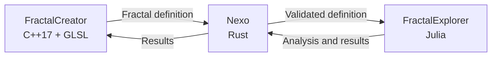

# Public architecture overview

This document describes UNION at a system level without exposing private
algorithms or implementation details.

## Design principles

- **Definitions over screenshots:** a structure is represented by portable
  data so that different tools can reproduce and analyse it.
- **Separation of responsibilities:** creation, transport, and analysis remain
  independent components.
- **Local-first operation:** the workflow does not require a hosted service for
  its core operation.
- **Reproducible exploration:** the same definition can move between visual and
  analytical tools.

## Development status

The functional foundation is implemented and UNION remains under active R&D.
Current work focuses on expressive and stable deformation, fidelity between
the creator and explorer, deeper zoom, and useful coordinated analysis.

Source code, protocol internals, build instructions, and implementation details
are intentionally excluded from this public repository.
